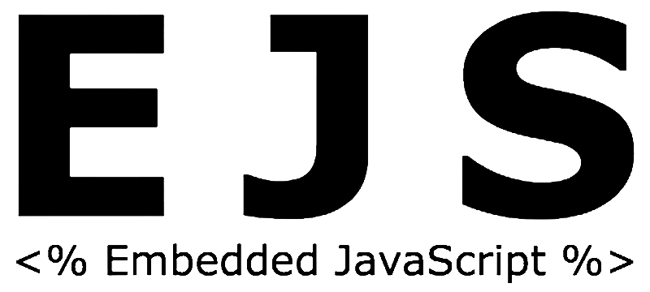

#Curated list of png/svg web-dev logos

### Currently:

1. [Bash](bash.png)
1. [CircleCI SVG](circleci.svg)
1. [Cucumber SVG](cucumber.svg)
1. [Cypress SVG](cypress.svg)
1. [Postman SVG](postman.svg)
1. [Ruby SVG](ruby.svg)
1. [Selenium SVG](selenium.svg)
1. [Vim](vim.png)
1. [WSO2](wso2.png)
1. [Angular ](angular.png)
1. [Arduino ](arduino.png)
1. [Azure](azure.png)
1. [Babel ](babel.png)
1. [Bootstrap ](bootstrap.png)
1. [Bourbon logo only ](bourbon-logo.png)
1. [Bourbon with text ](bourbon-logo-2.png)
1. [Bower ](bower.png)
1. [Browserify ](browserify.png)
1. [Browserify2 ](browserify2.png)
1. [CSS3 ](css3.png)
1. [Docker ](docker.png)
1. [EJS ](ejs.png)
1. [Express ](express.png)
1. [fFrebase ](firebase.png)
1. [Full mean stack ](fullMean.png)
1. [Git-fork ](git.png)
1. [Github ](github.png)
1. [Grunt ](grunt.ong.png)
1. [Gulp ](gulp.png)
1. [HTML5 ](html5.png)
1. [Jade ](jade.png)
1. [Jasmine png ](jasmine.png)
1. [Jasmine svg ](jasmine.svg)
1. [Javascript ](jslogo.png)
1. [Jquery ](jquery.png)
1. [Jquery-dark ](jq2.png)
1. [Materialize ](materialize.png)
1. [Mocha ](mocha.png)
1. [Mongo DB ](mongo.png)
1. [Mongoose ](mongoose.png)
1. [Nodejs png ](nodejs.png)
1. [Nodejs svg ](nodejs.svg)
1. [Nodemon ](nodemon.png)
1. [Npm ](npm.png)
1. [Postgres ](postgres.png)
1. [PugFace ](pugFace.png)
1. [PugSolid ](pugSolid.png)
1. [PugTextBW ](pugTextBW.png)
1. [PugTextColor ](pugTextColor.png)
1. [React ](react.png)
1. [Redis ](redis.png)
1. [Redux ](redux.png)
1. [Sass ](sass.png)
1. [Socket.io ](socketio.png)
1. [Tape ](tape.png)
1. [Yeoman ](yeoman-logo.png)

### Feel free to add your own, just make a PR!

PS - the SVG files don't work here (and most likely in your repo) due to an issue on Github:
https://github.com/isaacs/github/issues/316 but should work fine if you download them
for use on your site.

***
### Adding to the List
#### Formatting
Display:
1. [angular](angular.png)

Markup:
**`1. [angular](angular.png)  `**

Format:
**`1. [text to display](imageName.file)<imc src="imageName.file" height="desired height in pixels">`**
* The "1." at the beginning of the line stays the same throughout the list (markup knows to increment for you)
* The two instances of (imageName.file) are doing different things:
  1. **`[angular](angular.png)`** - sets it as a link to the github source file page (then you'll want to right click and copy img location)
  2. **``** - sets up the image in the README and sets the size to a height of 40px
